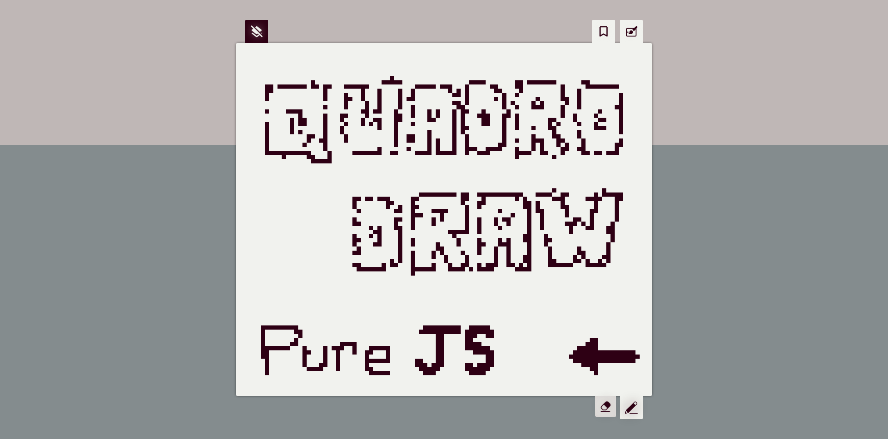
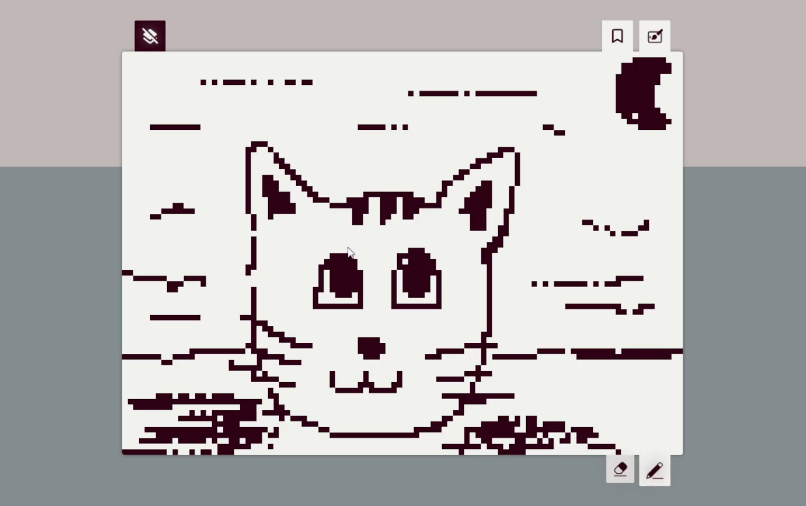
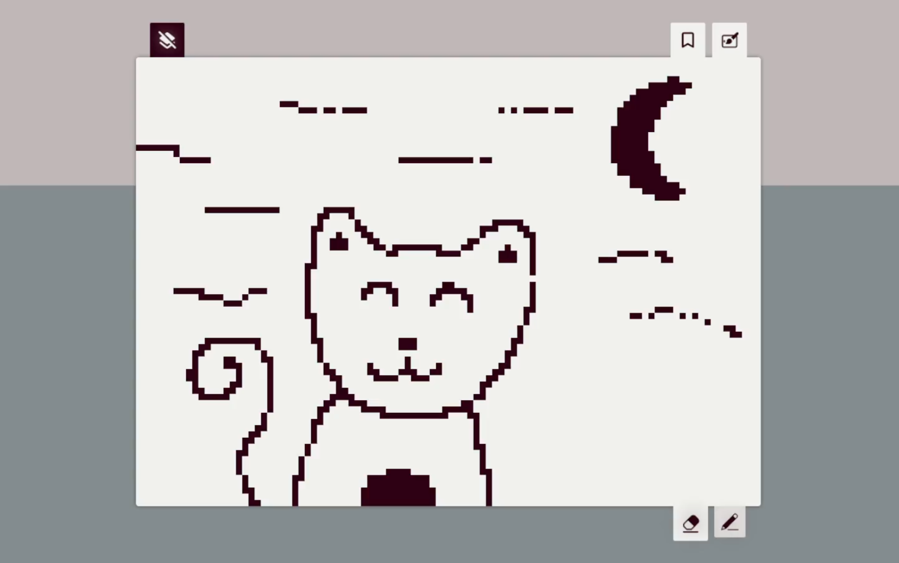
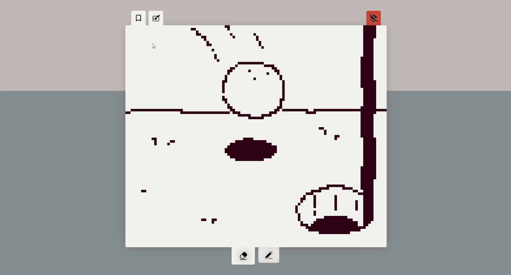
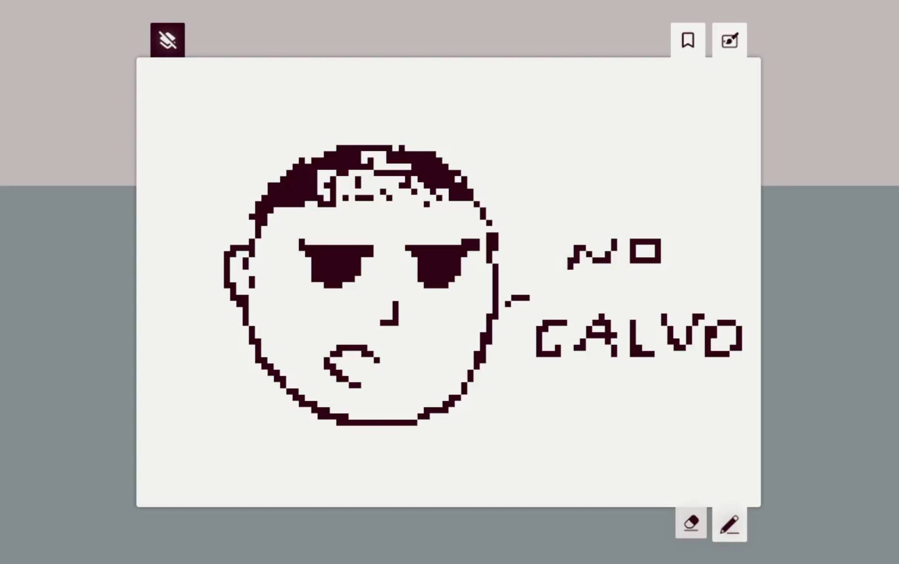

    

    
        <a href="https://refusado.github.io/quadro-draw/">View deployment</a>
    

### Quadro Draw

Um quadro de desenho responsivo desenvolvido em <b>javascript puro</b> com intuito de ser um ambiente de desenho simples, minimalista e prático.

#### Como usar

O projeto foi desenvolvido para funcionar totalmete em nível *client-side*, sendo assim, hospedei a página no próprio [Github Pages](https://pages.github.com/). Confira na prática e crie seus desenhos neste link: **[https://refusado.github.io/quadro-draw/](https://refusado.github.io/quadro-draw/)**

#### Funcionalidades 

Apesar da simplicidade trazer algumas limitações, o quadro possui várias ferramentas para ajudar no desenho, como:

- Pincel;
- Borracha;
- Limpar quadro;
- Salvar o desenho do quadro;
- Restaurar o desenho salvo.

#### Alguns desenhos

Esses são alguns exemplos de desenhos feitos no Quadro Draw por um artista profissional que eu contratei só para isso (confia) 

    
Tigre na Floresta

    

    
O Gato da Noite

    

    
A Boliña de Gorfe

    

    
Eu? Calvo? ( ͡ಠ ᖨ ͡ಠ)

    

